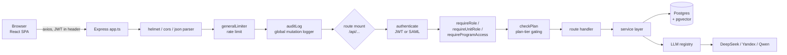
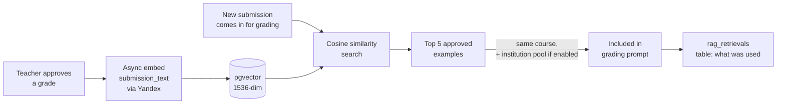

# Architecture

The 10,000-ft view: how a request moves through the system, and how the major subsystems fit together. For the file-by-file map, see the Navigation Guide in [`../CLAUDE.md`](../CLAUDE.md). For *why* certain constraints exist (not just what), see [`../Research.md`](../Research.md).

## Request lifecycle

Routes live in [`backend/src/routes/`](../backend/src/routes) (one file per resource, ~38 files), mounted in [`backend/src/app.ts`](../backend/src/app.ts). Order matters where paths overlap — e.g. `/api/admin/evals` is mounted before `/api/admin` so it isn't shadowed; same for `/api/institution/programs` and `/api/institution/structure` before `/api/institution`.

Middleware chain, in the order it actually runs (see `app.ts`): `helmet` → `cors` → body parsers → `generalLimiter` → `auditLog` → per-route mounts, each of which composes its own `authenticate` / `requireRole` / `checkPlan` as needed → `errorHandler` last.

Business logic lives in [`backend/src/services/`](../backend/src/services) (~80 files, excluding tests) — routes stay thin and delegate. Services talk to Postgres through [`backend/src/db/queries/`](../backend/src/db/queries) (parameterised SQL only, no ORM).

## Authorization model (§7 in Research.md)

Two independent axes:

- **`isPlatformAdmin`** — a flat boolean on `teachers`, for ИСПУМ staff (not institution staff).
- **Org tree** — `org_units` + `org_unit_roles`. A grant is **(level: admin/edit/view) × (domain: platform/curriculum/teaching/…) × (unit subtree)**, and it cascades down to descendant units. `domain` defaults to `'all'`, which `services/accessScope.ts` expands across every concrete domain — every institution-root admin from before the domain axis shipped is unaffected. `isInstitutionAdmin()` = holding `admin` **with `domain = 'all'`** on the tree's root unit — a domain-scoped admin grant (e.g. `domain='curriculum'`) is never institution admin, even though `role = 'admin'` alone would look the same. Level names were renamed `head` → `edit`, `viewer` → `view` in the same migration that added the domain column (087) — "head" read as a job title, not a permission level.
- **`requireDomain('curriculum' | 'teaching' | 'platform', level)`** ([`backend/src/middleware/requireDomain.ts`](../backend/src/middleware/requireDomain.ts)) gates a route on a specific domain instead of full institution-root admin — e.g. РПД monitor + institution criteria/rubrics require `curriculum`; institution overview/usage/roster-read require `teaching`. `canActOnUnit`/`teacherCanActOnUnit` ([`backend/src/middleware/requireUnitRole.ts`](../backend/src/middleware/requireUnitRole.ts)) take a **required** `domain` parameter — there is no "any domain" default, because a domain-blind check previously let a `curriculum` grant silently reach the `teaching`-only leadership dashboard. Teacher invite/deactivate, primary-department reassignment, and LTI/model/shared-RAG settings stay permanently `platform`-domain, root-admin-only — provisioning is centrally owned by IT at real institutions, never delegated per subtree.

The legacy `teachers.role` enum still exists but is a **synced mirror** — it's kept for backward compatibility / display, but server-side authorization always reads the org tree, never the enum directly. When adding a new permission check, use `requireUnitRole` / `requireDomain` / `requireProgramAccess` ([`backend/src/middleware/`](../backend/src/middleware)), not a raw role comparison — and always state which domain you're checking.

## Multi-provider LLM registry

All AI calls — grading, generation, embeddings — go through one seam: [`backend/src/services/llm/registry.ts`](../backend/src/services/llm/registry.ts). Nothing calls a provider SDK directly.

Resolution order per call:
1. Per-institution override (`institutions.preferred_provider`, if set)
2. `DEFAULT_LLM_PROVIDER` env var
3. Fall back to DeepSeek

Rules baked into the registry, not left to callers:
- **Embeddings always go through Yandex**, regardless of the resolved chat provider — a hard vector-space compatibility constraint (mixing embedding spaces breaks cosine similarity silently).
- **Calc/numeric grading always uses DeepSeek Reasoner** — the only provider trusted for arithmetic verification.
- **Silent fallback, two layers**: any non-DeepSeek provider that throws retries once on DeepSeek, so a flaky secondary provider never takes down grading. DeepSeek itself (the default) additionally resolves an ordered list of separately-billed accounts (`DEEPSEEK_API_KEY` plus optional `DEEPSEEK_API_KEY_2`..`_5`) and fails over between them on a retryable error (401/402/403/408/429/5xx/network), with a per-account cooldown and a Telegram alert on a successful failover — added after DeepSeek's own account balance took down every LLM feature platform-wide.
- **Qwen (DashScope)** is registered as a third provider (`services/llm/qwen.ts`) but is **not** institution-selectable via `preferred_provider` — DashScope isn't RU-resident, so it's reachable only via an explicit `providerOverride`, currently used to give the confidence ensemble a cross-model-family disagreement signal (same-model sampling under-reports "confidently wrong" cases).

Providers implement one `LLMProvider` interface (`chat` / `chatJSON` / `embed`) — adding a provider means implementing that interface and registering it in `PROVIDERS`, not touching call sites.

## The grading pipeline & `gradeOnce`

[`services/grading.ts`](../backend/src/services/grading.ts) exports `gradeOnce`, a **pure function** — no DB reads or writes. This is deliberate: it's shared verbatim between the live grading route and [`services/evalHarness.ts`](../backend/src/services/evalHarness.ts), which replays historical submissions offline to test prompt/model changes before they ship. If `gradeOnce` touched the DB, replay wouldn't be trustworthy. Anything DB-shaped (persistence, RAG retrieval, citation validation against the stored submission) happens in the calling route, around `gradeOnce`, not inside it.

Every AI-returned quote is checked by `validateCitation()` against the actual submission text before it's ever persisted — hallucinated quotes are nulled out, not shown to the teacher.

**Score production, in order, before persistence:** (1) the model's raw per-criterion/holistic score; (2) when criteria+weights are used, `aggregateWeightedScore` recomputes the overall score deterministically from the criteria snapshot (Σ(criterion score · weight)/100) instead of trusting the model's own holistic number, falling back to the model's score when criteria don't line up; (3) [`lib/scoreCalibration.ts`](../backend/src/lib/scoreCalibration.ts) + [`services/scoreCalibration.ts`](../backend/src/services/scoreCalibration.ts) apply a per-course/teacher/institution isotonic-regression correction (`score_calibration` table, most-specific-scope-first) fit against each scope's own history of `ai_score` vs. `approved_score` pairs — corrects each teacher's/course's systematic hot-or-cold bias, with a `null` fit (too little history) passing the raw score through unchanged; the **pre-calibration** score is separately persisted as `ai_score_raw` so a later refit trains on the model's actual output, not on its own prior correction. (4) `resolveGradeForScore` derives the grade letter from the final score against the canonical bands in [`shared/grades.ts`](../shared/grades.ts), so the persisted score and letter can never come apart. This is admin-triggered, not scheduled, as of writing.

The AI's output is never a final grade on its own: a row only becomes a training signal once a teacher approves it (`approved_at` set, `status = 'approved'`). See "Approval history" below.

## RAG flywheel

Institution-pool retrieval (pulling examples from other teachers at the same institution) requires **both** `institutions.shared_rag_enabled` **and** the specific `courses.share_rag_with_institution` flag — an institution-wide opt-in alone isn't enough, a course must also opt in. Cross-teacher retrieval results are PII-sanitised before reaching the prompt.

## ВКР / long-document review (map-reduce)

For submissions over ~120k characters (theses, dissertations — "ВКР"), a single-pass LLM call doesn't fit context or stay coherent. [`services/longReview.ts`](../backend/src/services/longReview.ts) runs a six-tier map-reduce instead:

1. Split into chapters
2. Analyse each chapter independently (map)
3. Synthesise chapter analyses into one review
4. Cross-section consistency pass (catches contradictions between chapters)
5. Premise-verification pass
6. Recomputation pass (re-derives any numeric/calc claims) + defence-question generation

This runs as a background job via [`services/jobQueue.ts`](../backend/src/services/jobQueue.ts) (pg-boss) and [`services/longReviewWorker.ts`](../backend/src/services/longReviewWorker.ts) — progress is pollable from the frontend rather than held open on one HTTP request. Job state is persisted in Postgres so a PM2 restart mid-review doesn't lose progress (see [`../TODO.md`](../TODO.md) for follow-up work here).

## Published assignments & process attestation (§5.1 in Research.md)

Teacher publishes an assignment → each student gets a tokenised link (no account required) → student writes in a TipTap editor after a consent gate, with periodic autosave → the frontend aggregates process telemetry (active time, revision count, paste ratio — never raw keystrokes or content diffing) → the teacher opens the submission, reads the neutral process report, and grades with one click. Grading on this path is **holistic only for v1** — published-assignment submissions don't yet carry a criteria/weight picker; criteria-scoped grading here is an open follow-up (see `TODO.md` item Q). This is the "process-of-creation attestation" feature referenced in `FEATURES.md`; full design rationale (including what telemetry is deliberately *not* collected, and why) is in `Research.md` §5.

## LTI 1.3 integration (§6 in Research.md)

ИСПУМ can be registered as an LTI 1.3 tool in an LMS (Moodle, primarily). [`services/lti.ts`](../backend/src/services/lti.ts) and [`routes/lti.ts`](../backend/src/routes/lti.ts) mirror the existing SAML SSO integration structurally (per-institution platform config, JIT teacher provisioning, an OIDC state/nonce replay-defense table) but over the LTI protocol instead: OIDC third-party-initiated login → signed launch JWT validated against the platform's JWKS (`jose`) → teacher lands authenticated, no separate account. A single ИСПУМ-side RSA keypair is published at `/api/lti/jwks` for platforms to verify against, rather than a pinned certificate.

Beyond the base launch, four capabilities build on the same foundation: **Deep Linking** (a teacher adds ИСПУМ as a Moodle activity, picking or creating a published assignment via a picker page; ИСПУМ signs the outbound `LtiDeepLinkingResponse` itself — the one place it signs rather than verifies a JWT); **student launch** (a Learner-role launch resolves idempotently to the same tokenised `/student/:token` writing rail published assignments already use — LTI only changes how the invite is created and how the student arrives, not the writing/attestation flow itself); **AGS grade write-back** (approving a grade for an LTI-launched submission posts the score to the Moodle gradebook as a fire-and-forget side effect of `approve()`, never blocking or failing the approval); and **NRPS roster sync** (pulls the Moodle course roster to bulk-create ordinary invites). **IMS Dynamic Registration** lets an admin register the platform from a single link pasted into Moodle instead of copying seven config fields by hand.

## Data model essentials

Full DDL is in [`backend/src/db/schema.sql`](../backend/src/db/schema.sql) plus 90+ incremental migrations in [`backend/migrations/`](../backend/migrations). Load-bearing tables to know up front:

- `teachers`, `courses`, `criteria` — base entities
- `assignments` — the core grading record: holds both `ai_*` fields (raw model output) and `approved_*` fields (teacher-reviewed, what actually trains the flywheel) side by side, plus the `embedding vector(1536)` column used for RAG
- `approved_revisions` — append-only audit trail of every approval event (see below)
- `org_units` / `org_unit_roles` — the institution hierarchy and permission grants described above
- `rag_retrievals` — which approved examples were surfaced for which grading call

## Approval history is append-only

Every time a teacher approves a grade, a new row goes into `approved_revisions` — the `assignments` row itself gets updated in place, but the history of every approval (including edits/re-approvals) survives independently. Never `UPDATE` or `DELETE` an existing `approved_revisions` row.

## Cross-cutting concerns

- **Prompt injection**: any user-supplied text going into an LLM prompt passes through `sanitiseForPrompt()` first — no exceptions.
- **SQL**: parameterised queries only (`pool.query(text, params[])`); no string interpolation into SQL, ever.
- **Plan gating**: paid features call `canUseFeature(planTier, 'featureName')` at the route level — limits are never hardcoded per-route.
- **Audit logging**: [`middleware/auditLog.ts`](../backend/src/middleware/auditLog.ts) logs every authenticated POST/PUT/PATCH/DELETE that returns 2xx, globally. Routes that need richer audit detail than the generic logger captures set `res.locals.selfAudited` to signal they've handled their own logging.

These are enforced conventions, not suggestions — see [`CONVENTIONS.md`](CONVENTIONS.md) for the full non-negotiable list and how to apply it when writing new code.
