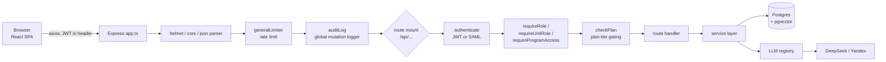
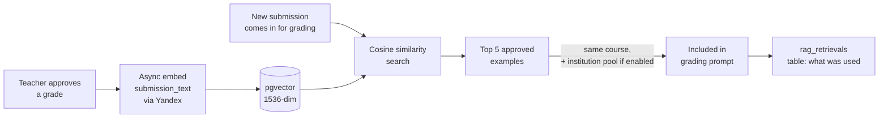

# Architecture

The 10,000-ft view: how a request moves through the system, and how the major subsystems fit together. For the file-by-file map, see the Navigation Guide in [`../CLAUDE.md`](../CLAUDE.md). For *why* certain constraints exist (not just what), see [`../Research.md`](../Research.md).

## Request lifecycle

Routes live in [`backend/src/routes/`](../backend/src/routes) (one file per resource, ~23 files), mounted in [`backend/src/app.ts`](../backend/src/app.ts). Order matters where paths overlap — e.g. `/api/admin/evals` is mounted before `/api/admin` so it isn't shadowed; same for `/api/institution/programs` and `/api/institution/structure` before `/api/institution`.

Middleware chain, in the order it actually runs (see `app.ts`): `helmet` → `cors` → body parsers → `generalLimiter` → `auditLog` → per-route mounts, each of which composes its own `authenticate` / `requireRole` / `checkPlan` as needed → `errorHandler` last.

Business logic lives in [`backend/src/services/`](../backend/src/services) (~37 files) — routes stay thin and delegate. Services talk to Postgres through [`backend/src/db/queries/`](../backend/src/db/queries) (parameterised SQL only, no ORM).

## Authorization model (§7 in Research.md)

Two independent axes:

- **`isPlatformAdmin`** — a flat boolean on `teachers`, for ИСПУМ staff (not institution staff).
- **Org tree** — `org_units` + `org_unit_roles`. A teacher can hold `admin` / `head` / `viewer` on any node in an institution's unit tree (faculty → department → course, etc.), and the role cascades down to descendant units. `isInstitutionAdmin()` = holding `admin` on the tree's root unit.

The legacy `teachers.role` enum still exists but is a **synced mirror** — it's kept for backward compatibility / display, but server-side authorization always reads the org tree, never the enum directly. When adding a new permission check, use `requireUnitRole` or `requireProgramAccess` ([`backend/src/middleware/`](../backend/src/middleware)), not a raw role comparison.

## Multi-provider LLM registry

All AI calls — grading, generation, embeddings — go through one seam: [`backend/src/services/llm/registry.ts`](../backend/src/services/llm/registry.ts). Nothing calls a provider SDK directly.

Resolution order per call:
1. Per-institution override (`institutions.preferred_provider`, if set)
2. `DEFAULT_LLM_PROVIDER` env var
3. Fall back to DeepSeek

Rules baked into the registry, not left to callers:
- **Embeddings always go through Yandex**, regardless of the resolved chat provider — a hard vector-space compatibility constraint (mixing embedding spaces breaks cosine similarity silently).
- **Calc/numeric grading always uses DeepSeek Reasoner** — the only provider trusted for arithmetic verification.
- **Silent fallback**: if a non-DeepSeek provider throws, the call retries once on DeepSeek and logs a warning, so a flaky provider doesn't take down grading.

Providers implement one `LLMProvider` interface (`chat` / `chatJSON` / `embed`) — adding a provider means implementing that interface and registering it in `PROVIDERS`, not touching call sites.

## The grading pipeline & `gradeOnce`

[`services/grading.ts`](../backend/src/services/grading.ts) exports `gradeOnce`, a **pure function** — no DB reads or writes. This is deliberate: it's shared verbatim between the live grading route and [`services/evalHarness.ts`](../backend/src/services/evalHarness.ts), which replays historical submissions offline to test prompt/model changes before they ship. If `gradeOnce` touched the DB, replay wouldn't be trustworthy. Anything DB-shaped (persistence, RAG retrieval, citation validation against the stored submission) happens in the calling route, around `gradeOnce`, not inside it.

Every AI-returned quote is checked by `validateCitation()` against the actual submission text before it's ever persisted — hallucinated quotes are nulled out, not shown to the teacher.

The AI's output is never a final grade on its own: a row only becomes a training signal once a teacher approves it (`approved_at` set, `status = 'approved'`). See "Approval history" below.

## RAG flywheel

Institution-pool retrieval (pulling examples from other teachers at the same institution) requires **both** `institutions.shared_rag_enabled` **and** the specific `courses.share_rag_with_institution` flag — an institution-wide opt-in alone isn't enough, a course must also opt in. Cross-teacher retrieval results are PII-sanitised before reaching the prompt.

## ВКР / long-document review (map-reduce)

For submissions over ~120k characters (theses, dissertations — "ВКР"), a single-pass LLM call doesn't fit context or stay coherent. [`services/longReview.ts`](../backend/src/services/longReview.ts) runs a six-tier map-reduce instead:

1. Split into chapters
2. Analyse each chapter independently (map)
3. Synthesise chapter analyses into one review
4. Cross-section consistency pass (catches contradictions between chapters)
5. Premise-verification pass
6. Recomputation pass (re-derives any numeric/calc claims) + defence-question generation

This runs as a background job via [`services/jobQueue.ts`](../backend/src/services/jobQueue.ts) (pg-boss) and [`services/longReviewWorker.ts`](../backend/src/services/longReviewWorker.ts) — progress is pollable from the frontend rather than held open on one HTTP request. Job state is persisted in Postgres so a PM2 restart mid-review doesn't lose progress (see [`../TODO.md`](../TODO.md) for follow-up work here).

## Published assignments & process attestation (§5.1 in Research.md)

Teacher publishes an assignment → each student gets a tokenised link (no account required) → student writes in a TipTap editor after a consent gate → the frontend aggregates process telemetry (active time, revision count, paste ratio — never raw keystrokes or content diffing) → the teacher sees a neutral process report alongside the grade. This is the "process-of-creation attestation" feature referenced in `FEATURES.md`; full design rationale (including what telemetry is deliberately *not* collected, and why) is in `Research.md` §5.

## Data model essentials

Full DDL is in [`backend/src/db/schema.sql`](../backend/src/db/schema.sql) plus 71+ incremental migrations in [`backend/migrations/`](../backend/migrations). Load-bearing tables to know up front:

- `teachers`, `courses`, `criteria` — base entities
- `assignments` — the core grading record: holds both `ai_*` fields (raw model output) and `approved_*` fields (teacher-reviewed, what actually trains the flywheel) side by side, plus the `embedding vector(1536)` column used for RAG
- `approved_revisions` — append-only audit trail of every approval event (see below)
- `org_units` / `org_unit_roles` — the institution hierarchy and permission grants described above
- `rag_retrievals` — which approved examples were surfaced for which grading call

## Approval history is append-only

Every time a teacher approves a grade, a new row goes into `approved_revisions` — the `assignments` row itself gets updated in place, but the history of every approval (including edits/re-approvals) survives independently. Never `UPDATE` or `DELETE` an existing `approved_revisions` row.

## Cross-cutting concerns

- **Prompt injection**: any user-supplied text going into an LLM prompt passes through `sanitiseForPrompt()` first — no exceptions.
- **SQL**: parameterised queries only (`pool.query(text, params[])`); no string interpolation into SQL, ever.
- **Plan gating**: paid features call `canUseFeature(planTier, 'featureName')` at the route level — limits are never hardcoded per-route.
- **Audit logging**: [`middleware/auditLog.ts`](../backend/src/middleware/auditLog.ts) logs every authenticated POST/PUT/PATCH/DELETE that returns 2xx, globally. Routes that need richer audit detail than the generic logger captures set `res.locals.selfAudited` to signal they've handled their own logging.

These are enforced conventions, not suggestions — see [`CONVENTIONS.md`](CONVENTIONS.md) for the full non-negotiable list and how to apply it when writing new code.
