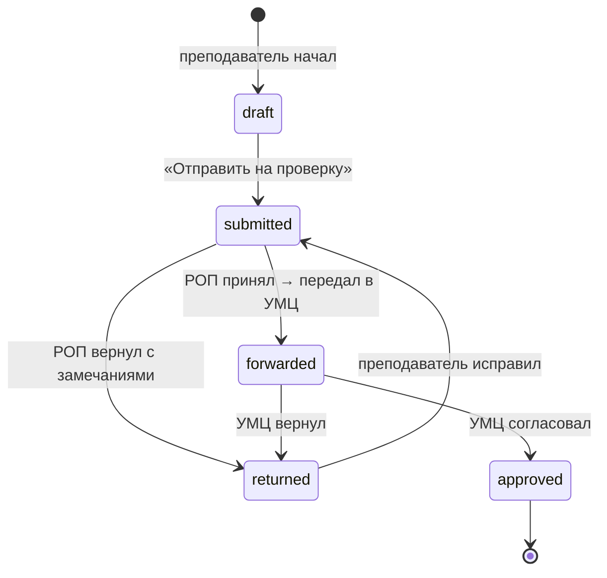

# Маршрут согласования РПД — спецификация

**Status:** DRAFT for review. Правьте свободно — как с
[ACCESS-MATRIX.md](ACCESS-MATRIX.md), это станет спекой для реализации.

Целевой процесс (ваша формулировка):
**Преподаватель сдаёт РПД → РОП проверяет → передаёт в УМЦ → РУМЦ видит
статистику по всему этому.**

Строится внутри **РОП Студии** (решено).

---

## 1. Что есть сегодня — и чего нет

Платформа хранит **артефакты**, но не знает ни одного **состояния**.

| Есть | Нет |
|---|---|
| `program_documents` — файл РПД по дисциплине, версии + supersede (084) | Статус: черновик / сдан / на проверке / возвращён / согласован |
| `program_document_reviews` — ИИ-проверка покрытия компетенций (Feature K) | Человеческий вердикт: кто, когда, что решил, с каким комментарием |
| `syllabus_studio_drafts` — черновики РПД-студии преподавателя | Связь черновика с дисциплиной программы |
| Готовность УМК — «файл загружен, ИИ проверил» | «На каком этапе застряло и у кого» |

**Две несвязанные половины.** Преподаватель пишет РПД в РПД-студии (`/curriculum`,
черновики привязаны к нему лично). РОП/УМЦ загружают файлы в программу
(`POST /:id/documents`). Между ними нет ничего.

> 🚧 **Жёсткий блокер:** роутер `/api/institution/programs` закрыт
> `requireProgramAccess`. У обычного преподавателя `program_access = 'none'` —
> он **не может обратиться ни к одному эндпоинту программ**. Сдать РПД сегодня
> физически некуда. Это первое, что нужно решить (§4).

---

## 2. Модель состояний



**Пять состояний**, не шесть: `returned` — одно состояние, а *кто* вернул
пишется отдельным полем (`returned_by_stage`). Возврат от УМЦ по умолчанию
попадает к преподавателю, но РОП видит его в своей очереди (он отвечает за
программу).

| Состояние | Смысл | Кто выводит дальше |
|---|---|---|
| `draft` | Преподаватель работает | Преподаватель |
| `submitted` | Ждёт проверки РОП | РОП |
| `returned` | Возвращён на доработку | Преподаватель |
| `forwarded` | Принят РОП, ждёт УМЦ | УМЦ (методист / РУМЦ) |
| `approved` | Согласован | — (терминальное) |

**ИИ-проверка запускается автоматически при `submitted`** — РОП открывает
заявку, где отчёт о покрытии компетенций уже приложен. ИИ — первичный фильтр,
решение принимает человек (правило «ИИ никогда не финален»).

---

## 3. Ответственный за дисциплину

Сегодня «чей это РПД» нигде не записано. `program_disciplines.course_id →
courses.teacher_id` — необязательная и косвенная связь.

**Нужна явная колонка** `program_disciplines.responsible_teacher_id`.
Это же заменяет отклонённый домен `syllabus` из access-matrix: право править
РПД дисциплины — это назначенная ответственность, а не грант в дереве.

Назначает: РОП (в рамках своей программы) или УМЦ.

---

## 4. Доступ — новые возможности

| Возможность | Кто | Как гейтится |
|---|---|---|
| Видеть свои дисциплины, писать и сдавать РПД | Ответственный преподаватель | **По ответственности**, не грантом |
| Проверить / вернуть / передать в УМЦ | РОП | `curriculum:edit` на поддереве программы |
| Проверить / вернуть / согласовать (этап УМЦ) | УМУ, РУМЦ, МУМЦ | `umu:edit` |
| Назначить ответственного за дисциплину | РОП, УМЦ | `curriculum:edit` |
| Опубликовать отчёт руководству | РУМЦ | `umu:edit` |
| Читать опубликованные отчёты | Ректор, Проректор | `teaching:view` **на корне организации** |

**Решение блокера из §1:** не расширять `requireProgramAccess`, а завести
**узкую преподавательскую поверхность** — `/api/my-syllabi/*`, которая отдаёт
только те дисциплины, где преподаватель указан ответственным. Расширять широкий
админский роутер ради одной роли — это ровно тот класс утечки, что уже дважды
ловили в доменной оси.

**Про «на корне организации»:** отчёт УМЦ — общевузовский документ. Гейт
`teaching:view` + грант на корневой единице естественно впускает Ректора и
Проректора и не впускает Завкафедрой (его грант ниже по дереву). Новый домен
не нужен — работает существующая ось поддерева.

---

## 5. Публикация отчёта: РУМЦ → руководство

Сегодня РУМЦ собирает Excel и шлёт Проректору почтой. Заменяем этим:

- РУМЦ жмёт **«Поделиться с руководством»** на Готовности УМК / Мониторинге РПД
- Сохраняется **замороженный снимок** (не живая ссылка) + дата + автор
- У руководства появляется список отчётов только для чтения

**Почему снимок, а не живой доступ:** это и есть эквивалент её Excel-файла — она
контролирует, *что* и *на какой момент* показано. Живой доступ означал бы, что
руководство видит незавершённые данные в любой момент — то, чего она сегодня
намеренно избегает.

---

## 6. Что меняется на существующих экранах

| Экран | Изменение |
|---|---|
| **РПД-студия** (`/curriculum`, преподаватель) | Выбор дисциплины из назначенных + «Отправить на проверку» + бейдж статуса + замечания при возврате |
| **РОП Студия** (`/rop-studio`) | Новая вкладка **«Проверка РПД»** — очередь `submitted` по своим программам, с приложенным ИИ-отчётом; действия «Вернуть» / «Передать в УМЦ» |
| **Готовность УМК** (`/institution/umc`) | Колонка **этапа согласования** вместо только «загружен / проверен ИИ» — наконец отвечает «где застряло». Плюс кнопка «Поделиться с руководством» |
| **Карточка программы** | Этап согласования рядом с каждой дисциплиной |
| **Новый:** «Отчёты УМЦ» | Список опубликованных снимков, только чтение, для руководства |

Готовность УМК от этого становится **полезнее**, а не дублируется: сегодня она
знает про файл и оценку ИИ, после — про стадию процесса.

---

## 7. Схема данных

```sql
-- Ответственный за РПД дисциплины
ALTER TABLE program_disciplines
  ADD COLUMN responsible_teacher_id UUID REFERENCES teachers(id) ON DELETE SET NULL;

-- Текущее состояние согласования, одна строка на дисциплину
CREATE TABLE rpd_submissions (
  id                 UUID PRIMARY KEY DEFAULT gen_random_uuid(),
  program_id         UUID NOT NULL REFERENCES programs(id) ON DELETE CASCADE,
  discipline_id      UUID NOT NULL REFERENCES program_disciplines(id) ON DELETE CASCADE,
  document_id        UUID REFERENCES program_documents(id) ON DELETE SET NULL,
  status             TEXT NOT NULL DEFAULT 'draft',
  returned_by_stage  TEXT,          -- 'rop' | 'umc' — кто вернул
  submitted_by       UUID REFERENCES teachers(id) ON DELETE SET NULL,
  submitted_at       TIMESTAMPTZ,
  updated_at         TIMESTAMPTZ NOT NULL DEFAULT NOW(),
  UNIQUE (discipline_id)
);

-- Журнал переходов — append-only, как approved_revisions (правило #5)
CREATE TABLE rpd_submission_events (
  id             UUID PRIMARY KEY DEFAULT gen_random_uuid(),
  submission_id  UUID NOT NULL REFERENCES rpd_submissions(id) ON DELETE CASCADE,
  from_status    TEXT,
  to_status      TEXT NOT NULL,
  actor_id       UUID REFERENCES teachers(id) ON DELETE SET NULL,
  comment        TEXT,          -- замечания при возврате
  created_at     TIMESTAMPTZ NOT NULL DEFAULT NOW()
);

-- Опубликованные снимки отчётов УМЦ
CREATE TABLE umc_published_reports (
  id             UUID PRIMARY KEY DEFAULT gen_random_uuid(),
  institution_id UUID NOT NULL REFERENCES institutions(id) ON DELETE CASCADE,
  kind           TEXT NOT NULL,   -- 'umk_readiness' | 'rpd_monitor'
  title          TEXT NOT NULL,
  payload        JSONB NOT NULL,  -- замороженный снимок
  published_by   UUID REFERENCES teachers(id) ON DELETE SET NULL,
  published_at   TIMESTAMPTZ NOT NULL DEFAULT NOW()
);
```

Журнал переходов — **append-only**, как `approved_revisions`: спор «мне это не
возвращали» решается записью, а не памятью.

---

## 8. Уведомления (v1 — три письма)

| Событие | Кому |
|---|---|
| `submitted` | РОП программы |
| `returned` | Ответственному преподавателю (+ текст замечаний) |
| `approved` | Ответственному преподавателю |

Инфраструктура есть: `services/emailTransport.ts` + `lib/emailTemplates.ts`
(тот же паттерн, что у приглашений).

---

## 9. Явно НЕ в v1

- Параллельная проверка несколькими рецензентами
- Сроки/дедлайны и напоминания о них (это Feature F — календарь)
- Комментарии внутри текста документа (только общий комментарий при возврате)
- Автопередача в УМЦ по достижению порога покрытия ИИ (человек решает всегда)
- Массовые действия («принять все») — сначала посмотреть на реальные объёмы

---

## 10. Связь с Мониторингом РПД (АСУ)

Это **разные вещи**, и пока они параллельны:

| | Мониторинг РПД | Маршрут согласования |
|---|---|---|
| Источник | Выгрузка из АСУ Университет (вручную, еженедельно) | Сама платформа |
| Что меряет | Внешнюю отчётность: сдано/долг по данным АСУ | Внутреннее состояние документа |
| Про качество | Ничего | Покрытие компетенций + вердикт человека |

**Долгосрочно:** когда маршрут приживётся, платформа знает реальный статус
первой рукой, и еженедельная выгрузка из АСУ становится сверкой, а не источником
правды. Это путь к тому, чтобы убрать ручной шаг совсем — но это **Feature AC /
Improvement #12**, не сейчас.

---

## 11. Открытые вопросы

1. **Возврат от УМЦ — кому?** Предложено: преподавателю, но РОП видит в своей
   очереди. Или строго через РОП (УМЦ → РОП → преподаватель)?
2. **Может ли РОП согласовать без УМЦ?** Сейчас в модели — нет, УМЦ всегда
   последний. Бывают ли дисциплины, где этап УМЦ не нужен?
3. **Что если ответственный не назначен?** Дисциплина просто не появляется ни у
   кого — нужен ли РОП список «без ответственного»? (Похоже, да.)
4. **Кто грузит файл на этапе `submitted`** — преподаватель через новую
   поверхность, или он пишет в РПД-студии и система сама формирует документ?
5. **Один РПД на дисциплину на год?** Сейчас `UNIQUE (discipline_id)` — одна
   активная заявка. При переходе на новый учебный год нужен сброс/архив.

---

## 12. Фазы

| # | Что | Размер |
|---|---|---|
| 4a | Ответственный за дисциплину + `/api/my-syllabi` (преподаватель видит свои) | S |
| 4b | Состояния + переходы + журнал + очередь РОП в РОП Студии | M |
| 4c | Этап УМЦ + колонка стадии в Готовности УМК | S |
| 4d | Уведомления (3 письма) | S |
| 4e | Публикация отчёта РУМЦ → руководство + экран «Отчёты УМЦ» | S–M |

**4a первым и отдельно:** без «ответственного» ни один следующий шаг не имеет
смысла, а сам по себе он уже полезен — РОП наконец видит, кто за что отвечает,
и где дисциплины-сироты.

**4e независим** от 4a–4d: публикация снимка Готовности УМК работает уже на
сегодняшних данных и сразу убирает Excel-по-почте. Если нужен быстрый
результат — можно начать с него.
